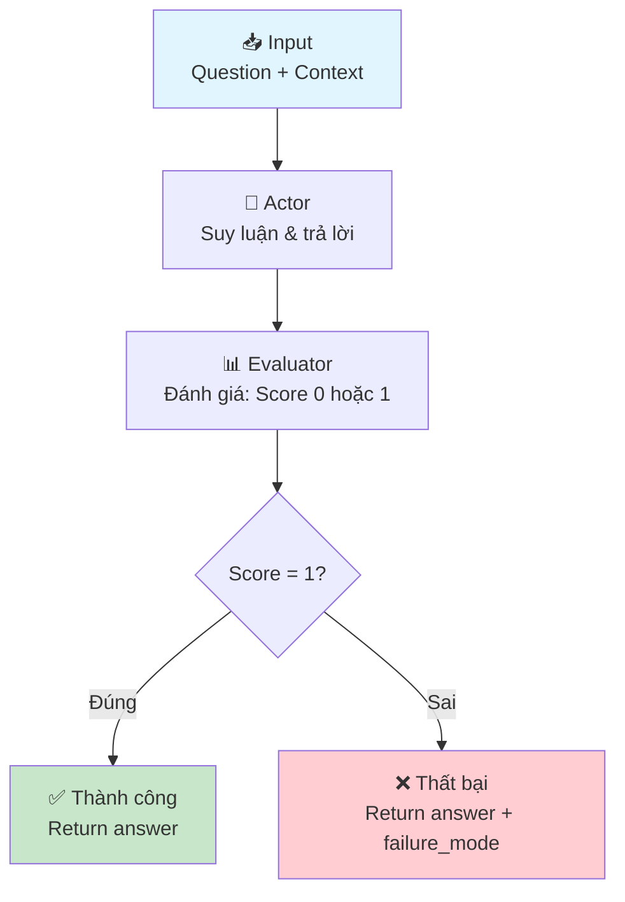
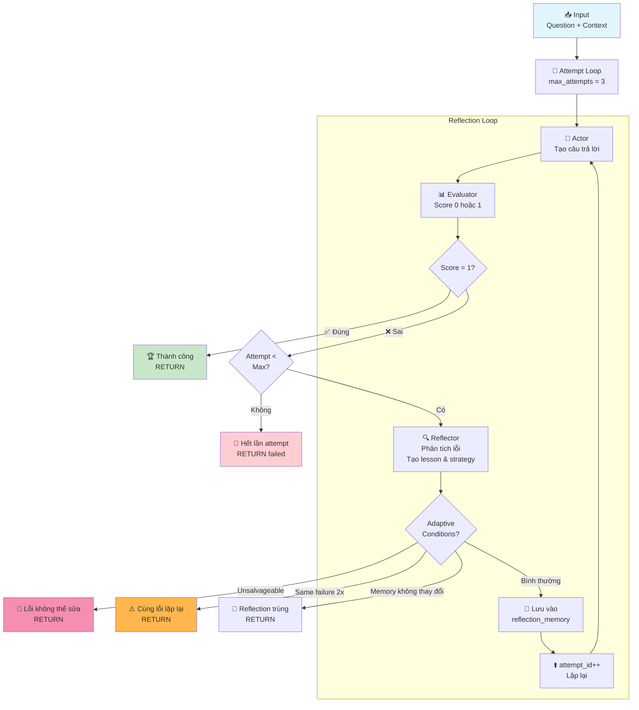

# React Agent vs Reflexion Agent Architecture

## 📋 Mục lục
1. [Tổng Quan](#tổng-quan)
2. [React Agent](#react-agent)
3. [Reflexion Agent](#reflexion-agent)
4. [So Sánh](#so-sánh)
5. [Kiến Trúc Chi Tiết](#kiến-trúc-chi-tiết)
6. [Ví Dụ Thực Tế](#ví-dụ-thực-tế)

---

## Tổng Quan

Dự án này xây dựng hai loại agent để giải quyết bài toán **Multi-hop Question Answering (QA)** - đó là những câu hỏi cần truy vấn, lọc thông tin từ nhiều đoạn văn bản liên quan để tìm ra câu trả lời chính xác.

### Đặc Điểm Chung

- **Input**: Question + Context (danh sách các đoạn văn bản)
- **Output**: Câu trả lời (answer) 
- **Goal**: Trả lời chính xác dựa trên context được cung cấp
- **Runtime**: Sử dụng LLM (Large Language Model) thông qua OpenAI-compatible API

### Thành Phần Cốt Lõi

Mỗi agent đều có 3 module chính:

```
┌─────────────────────────────────┐
│      RuntimeAdapter (Protocol)  │
├─────────────────────────────────┤
│ • actor()      - Tạo câu trả lời│
│ • evaluator()  - Đánh giá kết quả
│ • reflector()  - Phản ánh & cải thiện
└─────────────────────────────────┘
```

---

## React Agent

### Khái Niệm

**ReAct** (Reason + Act) là một cách tiếp cận agent mà tại mỗi bước:
1. **Reason**: Suy luận (chain-of-thought)
2. **Act**: Hành động (gọi tool, truy vấn, v.v.)

Trong trường hợp này, ReAct Agent **chỉ chạy 1 lần duy nhất** - không có reflection hay cải thiện lặp lại.

### Cấu Trúc Lớp

```python
class ReActAgent(BaseAgent):
    def __init__(self, runtime: RuntimeAdapter) -> None:
        super().__init__(
            runtime=runtime,
            agent_type="react",
            max_attempts=1,           # ← Chỉ 1 lần
            adaptive_max_attempts=False
        )
```

### Flow Diagram




### Key Metrics (Sau 1 Attempt)

| Metric | Giá Trị |
|--------|---------|
| Max Attempts | 1 |
| Reflection | ❌ Không |
| Learning | ❌ Không |
| Latency | Nhanh (1 lần gọi LLM) |
| Token Cost | Thấp (ít LLM call) |
| Accuracy | Trung bình |

---

## Reflexion Agent

### Khái Niệm

**Reflexion** là một cách tiếp cận nâng cao mà agent:
1. **Attempt** lần 1: Tạo câu trả lời
2. **Evaluate**: Đánh giá kết quả
3. **Reflect**: Nếu sai → phân tích lỗi và học bài học
4. **Retry**: Attempt lần 2, 3,... với những kiến thức mới

Quá trình này lặp lại cho đến khi:
- ✅ Câu trả lời đúng (score = 1)
- ❌ Hết số lần attempt
- 🔄 Tìm thấy lỗi không thể sửa (unsalvageable)

### Cấu Trúc Lớp

```python
class ReflexionAgent(BaseAgent):
    def __init__(
        self, 
        runtime: RuntimeAdapter, 
        max_attempts: int = 3,              # ← Có thể 3, 5, 10...
        adaptive_max_attempts: bool = True  # ← Dừng sớm nếu cần
    ) -> None:
        super().__init__(
            runtime=runtime,
            agent_type="reflexion",
            max_attempts=max_attempts,
            adaptive_max_attempts=adaptive_max_attempts,
        )
```

### Flow Diagram (Multiple Attempts)




### Key Metrics (Qua Nhiều Attempts)

| Metric | Giá Trị |
|--------|---------|
| Max Attempts | 3 (mặc định, có thể tùy chỉnh) |
| Reflection | ✅ Có |
| Learning | ✅ Có (reflection_memory + trajectory) |
| Latency | Cao (nhiều LLM call) |
| Token Cost | Cao (Actor + Evaluator + Reflector) |
| Accuracy | Cao (học từ lỗi) |

### Reflection Memory & Trajectory

#### Reflection Memory
```python
reflection_memory = [
    "lesson=..., strategy=...",  # Attempt 1 failed
    "lesson=..., strategy=...",  # Attempt 2 failed
]
```
- Lưu những bài học từ những lần attempt trước
- Được truyền cho **Actor** ở attempt tiếp theo
- Actor có thể học từ những lỗi trước đó

#### Trajectory
```python
trajectory = [
    "attempt=1 answer=... score=0 failure_mode=...",
    "attempt=2 answer=... score=0 failure_mode=...",
]
```
- Lưu lịch sử của tất cả các attempt (giữ 3 cái gần nhất)
- Được truyền cho Actor, Evaluator, Reflector
- Giúp agent nhìn thấy full context của việc nó đã làm

---

## So Sánh

### Bảng So Sánh Chi Tiết

```
┌──────────────────────┬──────────────────┬──────────────────┐
│ Đặc Điểm             │ React Agent      │ Reflexion Agent  │
├──────────────────────┼──────────────────┼──────────────────┤
│ Max Attempts         │ 1                │ 3 (tùy chỉnh)    │
│ Reflection Module    │ ❌ Không         │ ✅ Có            │
│ Learning             │ ❌ Không         │ ✅ Có            │
│ Adaptive Stopping    │ ❌ Không         │ ✅ Có            │
│ LLM Calls/Example    │ 2 (Actor+Eval)   │ 6-9 (×3 attempts)│
│ Latency              │ 🚀 Nhanh         │ 🐢 Chậm          │
│ Cost                 │ 💰 Rẻ           │ 💸 Đắt           │
│ Accuracy             │ ⭐⭐ Trung bình  │ ⭐⭐⭐⭐ Cao     │
│ Use Case             │ Fast inference   │ Hard questions   │
└──────────────────────┴──────────────────┴──────────────────┘
```

### Khi Nào Dùng?

#### React Agent
- ✅ Cần **tốc độ nhanh**
- ✅ Câu hỏi **đơn giản** (1 hop)
- ✅ **Budget hạn chế** (token/API call)
- ✅ **Real-time systems** (chat, assistant)
- ❌ Không cần học từ lỗi

#### Reflexion Agent
- ✅ Câu hỏi **phức tạp** (multi-hop)
- ✅ Cần **độ chính xác cao**
- ✅ **Offline/batch processing**
- ✅ **Fine-tuning/evaluation**
- ✅ Có **budget cho nhiều LLM call**

---

## Kiến Trúc Chi Tiết

### 1. Components Architecture

```
┌──────────────────────────────────────────────────────────────┐
│                        BaseAgent                             │
│  (Common logic cho cả React và Reflexion)                    │
├──────────────────────────────────────────────────────────────┤
│  run(example: QAExample) -> RunRecord                        │
│  ├─ Initialization (memory, traces, scores)                 │
│  ├─ Main Loop: for attempt_id in range(1, max_attempts+1)   │
│  │  ├─ Call actor()      → answer                           │
│  │  ├─ Call evaluator()  → JudgeResult                      │
│  │  ├─ Create AttemptTrace                                  │
│  │  ├─ Check stopping conditions                            │
│  │  ├─ Call reflector()  → ReflectionEntry (nếu needed)     │
│  │  └─ Update trajectory & memory                           │
│  └─ Return RunRecord (tóm tắt toàn bộ)                      │
└──────────────────────────────────────────────────────────────┘
            ▲                                    ▲
            │                                    │
         extends                              extends
            │                                    │
    ┌───────┴───┐                        ┌──────┴────┐
    │           │                        │           │
ReActAgent   ReflexionAgent              ...        ...
(max=1)       (max=3, adaptive)
```

### 2. Data Flow

```
QAExample Input
    │
    ├─ question: str
    ├─ gold_answer: str
    ├─ context: list[ContextChunk]
    └─ qid: str
    
    ↓
    
Agent.run()
    │
    ├─ reflection_memory: list[str] (dành cho Reflexion)
    ├─ trajectory: list[str]
    └─ scores: int, attempt_id: int
    
    ↓
    
RuntimeAdapter calls:
    │
    ├─ actor() → RuntimeCall(answer)
    ├─ evaluator() → JudgeResult
    └─ reflector() → ReflectionEntry (nếu needed)
    
    ↓
    
Accumulate
    │
    ├─ traces: list[AttemptTrace]
    ├─ reflections: list[ReflectionEntry]
    └─ trajectory logs
    
    ↓
    
RunRecord (output)
    │
    ├─ predicted_answer
    ├─ is_correct
    ├─ attempts
    ├─ failure_mode
    ├─ reflections
    └─ traces (chi tiết từng attempt)
```

### 3. RuntimeAdapter Protocol

```python
class RuntimeAdapter(Protocol):
    """LLM Runtime abstraction - có thể implement bằng:
    - OpenAI API (gọi qua HTTP)
    - Mock LLM (fake responses)
    - Local LLM (Ollama, vLLM)
    """
    
    def actor(...) -> RuntimeCall:
        """Tạo câu trả lời từ question + context"""
        
    def evaluator(...) -> tuple[JudgeResult, RuntimeCall]:
        """Đánh giá: answer == gold_answer?"""
        
    def reflector(...) -> tuple[ReflectionEntry, RuntimeCall]:
        """Phân tích lỗi và tạo strategy"""
```

---

## Ví Dụ Thực Tế

### Example Dataset

```python
example = QAExample(
    qid="hop-2-001",
    difficulty="hard",
    question="Nhà soạn nhạc của bài hát được sử dụng làm nhạc nền "
             "trong phim của đạo diễn sinh năm 1980 là ai?",
    gold_answer="John Williams",
    context=[
        ContextChunk(
            title="Spielberg Filmography",
            text="Steven Spielberg sinh năm 1946. Ông đã đạo diễn "
                 "phim Jurassic Park (1993) với nhạc nền của John Williams..."
        ),
        ContextChunk(
            title="Jurassic Park Film",
            text="Jurassic Park là bộ phim khoa học viễn tưởng nổi tiếng. "
                 "Nhạc nền được sáng tác bởi nhạc sĩ John Williams..."
        ),
        ContextChunk(
            title="Director Born 1980",
            text="Christopher Nolan sinh năm 1980. Ông đã đạo diễn "
                 "Interstellar với nhạc của Hans Zimmer..."
        ),
    ]
)
```

### Scenario 1: React Agent (1 Lần)

```
Question: "Nhà soạn nhạc của bài hát được sử dụng làm nhạc nền 
           trong phim của đạo diễn sinh năm 1980 là ai?"

Gold Answer: "John Williams"
```

**Attempt 1:**

1. **Actor** (LLM Call 1):
   ```
   Input: question + context + no reflection
   Output: "Hans Zimmer"  ← Nó chọn nhạc sĩ của Interstellar
   ```

2. **Evaluator** (LLM Call 2):
   ```
   Evaluate: "Hans Zimmer" vs "John Williams"
   Score: 0 (Sai!)
   Failure Mode: "entity_drift" (nhầm sang director sai năm)
   ```

3. **Result**:
   ```
   RunRecord(
       predicted_answer="Hans Zimmer",
       is_correct=False,
       attempts=1,
       failure_mode="entity_drift",
       reflections=[],  # Không có reflection
   )
   ```

### Scenario 2: Reflexion Agent (3 Attempts)

Cùng câu hỏi, nhưng dùng ReflexionAgent:

```
Question: "Nhà soạn nhạc của bài hát được sử dụng làm nhạc nền 
           trong phim của đạo diễn sinh năm 1980 là ai?"

Gold Answer: "John Williams"
```

**Attempt 1:**

1. **Actor** (LLM Call 1):
   ```
   reflection_memory = []  # Không có bài học trước
   trajectory = []
   
   → Output: "Hans Zimmer"
   ```

2. **Evaluator** (LLM Call 2):
   ```
   Score: 0
   Failure Mode: "entity_drift"
   Reason: "Director born 1980 (Nolan) led to wrong composer"
   ```

3. **Reflector** (LLM Call 3):
   ```
   Input: failure_mode="entity_drift", reason="..."
   
   → Lesson: "Director sinh năm 1980 là Christopher Nolan (Interstellar).
              Nhưng câu hỏi hỏi về phim khác - cần kiểm tra kỹ."
   
   → Next Strategy: "Tìm đạo diễn khác sinh năm 1980. Hoặc kiểm tra 
                     Spielberg (sinh 1946) - không match. 
                     Tập trung vào bối cảnh: Jurassic Park."
   ```

4. **Update Memory**:
   ```
   reflection_memory = [
       "lesson=Director khác + tìm đạo diễn sinh 1980... | "
       "strategy=Kiểm tra context kỹ hơn"
   ]
   trajectory = [
       "attempt=1 answer=Hans Zimmer score=0 failure_mode=entity_drift"
   ]
   ```

---

**Attempt 2:**

1. **Actor** (LLM Call 4):
   ```
   reflection_memory = ["lesson=... strategy=..."]
   trajectory = ["attempt=1 ..."]
   
   → Được truyền reflection_memory, Actor biết đã mắc lỗi "entity_drift"
   → Actor suy luận lại: "Spielberg → Jurassic Park → John Williams"
   
   → Output: "John Williams"  ✅
   ```

2. **Evaluator** (LLM Call 5):
   ```
   Evaluate: "John Williams" vs "John Williams"
   Score: 1 (Đúng!)
   ```

3. **Success! Stop loop.**

**Final Result**:
```
RunRecord(
    predicted_answer="John Williams",
    is_correct=True,
    attempts=2,
    failure_mode="none",
    reflections=[
        ReflectionEntry(
            attempt_id=1,
            failure_reason="entity_drift: Director năm 1980 là Nolan, không Spielberg",
            lesson="Phải kiểm tra tất cả context, không nhầm đạo diễn",
            next_strategy="Trace: Spielberg → Jurassic Park → John Williams"
        )
    ],
)
```

### Metrics Comparison

```
                React Agent      Reflexion Agent
─────────────────────────────────────────────────
Attempts       1                2
LLM Calls      2 (Actor+Eval)   5 (A+E+R+A+E)
Tokens         ~2000            ~8000
Time           ~2 sec           ~10 sec
Cost           $0.02            $0.08
Result         ❌ Sai           ✅ Đúng
```

---

## Implementation Details

### Stopping Conditions (BaseAgent)

```python
def run(self, example: QAExample) -> RunRecord:
    for attempt_id in range(1, self.max_attempts + 1):
        # ... actor, evaluator calls ...
        
        # Condition 1: Correct answer (score = 1)
        if judge.score == 1:
            traces.append(trace)
            break  # ✅ SUCCESS
        
        # Condition 2: React agent (max_attempts=1, không reflection)
        if self.agent_type != "reflexion" or attempt_id >= self.max_attempts:
            traces.append(trace)
            break  # 🛑 STOP (React hoặc hết lần)
        
        # Condition 3: Adaptive - Unsalvageable error
        if self.adaptive_max_attempts and self._is_unsalvageable(...):
            traces.append(trace)
            break  # 🚫 LỖI KHÔNG THỂ SỬA
        
        # Condition 4: Adaptive - Same failure 2x liên tiếp
        if self.adaptive_max_attempts and same_failure_streak >= 2:
            traces.append(trace)
            break  # ⚠️ CÒN LẶP LỖI CŨ
        
        # Reflexion phase (chỉ nếu chưa break)
        reflection, reflect_call = self.runtime.reflector(...)
        reflection_memory.append(reflection_text)
        
        # Condition 5: Adaptive - Reflection memory không đổi
        if reflection_text == reflection_memory[-2]:
            traces.append(trace)
            break  # 🔄 REFLECTION TRÙNG
```

### Architecture Pattern

```
┌─────────────────────────────────────────────┐
│          Multi-Hop QA Problem               │
└──────────────┬────────────────────────────────┘
               │
               ├─→ React Agent ────→ 1 Answer
               │
               └─→ Reflexion Agent ────→ Refined Answer
                   (via reflection loop)
```

---

## Kết Luận

| Loại Agent | Ưu Điểm | Nhược Điểm | Best For |
|-----------|---------|-----------|----------|
| **React** | Nhanh, rẻ, đơn giản | Độ chính xác thấp, không học | Baseline, evaluation |
| **Reflexion** | Độ chính xác cao, học từ lỗi | Chậm, đắt, phức tạp | Production, hard QA |

**Recommendation**: 
- Dùng **React** để **evaluate nhanh** và **baseline**
- Dùng **Reflexion** để **improve accuracy** trên **hard questions**
