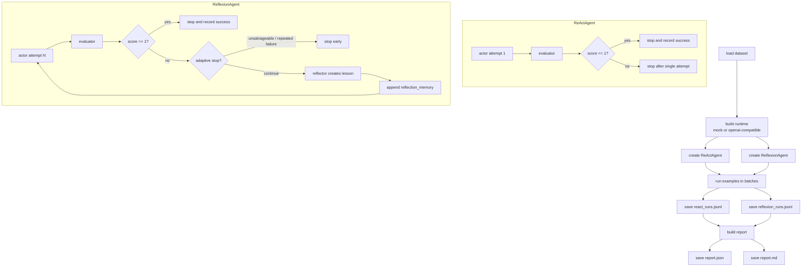
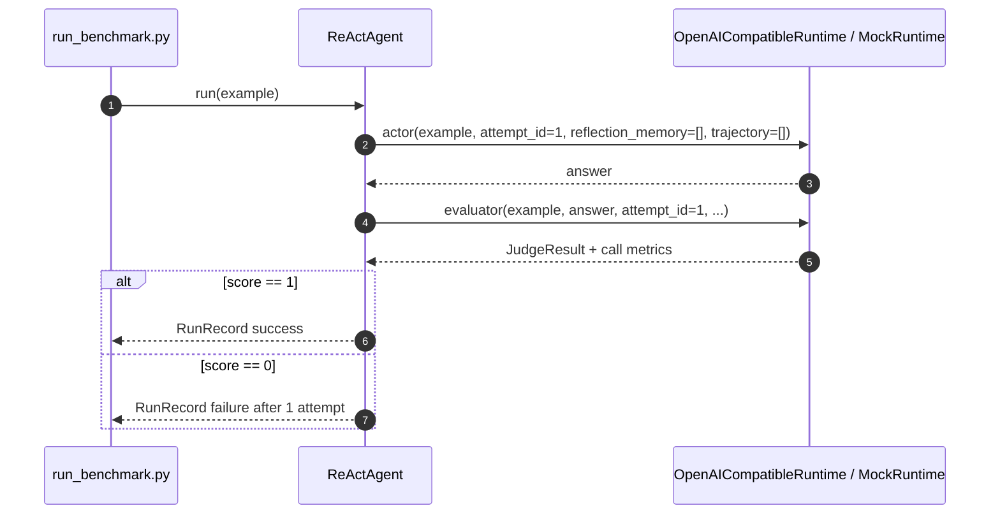
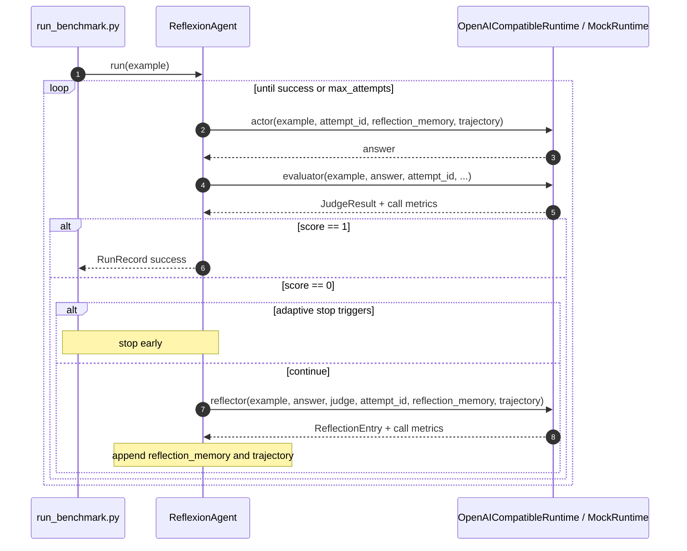

# Reflexion Lab - React & Reflexion Diagrams

Tài liệu này tóm tắt cách lab được cài đặt và cách hai agent hoạt động trong code hiện tại.

## Cài đặt nhanh

- Tạo môi trường ảo và cài dependency:

```bash
python -m venv .venv
.venv\Scripts\activate
pip install -r requirements.txt
```

- Với `real mode`, cần các biến môi trường:
  - `DEFAULT_MODEL`
  - `DEFAULT_BASE_URL`
  - `DEFAULT_API_KEY`
  - `JUDGE_MODEL`
  - tùy chọn: `JUDGE_BASE_URL`, `JUDGE_API_KEY`

- Chạy benchmark qua `run_benchmark.py`.
  - `mock` mode dùng runtime giả để smoke test.
  - `real` mode dùng OpenAI-compatible runtime.
  - Kết quả được ghi ra `react_runs.jsonl`, `reflexion_runs.jsonl`, `report.json`, `report.md`.

## Mô tả ngắn gọn kiến trúc

- `run_benchmark.py` nạp dataset, khởi tạo runtime, rồi chạy song song `ReActAgent` và `ReflexionAgent` trên cùng bộ câu hỏi.
- `BaseAgent.run()` là nơi điều phối vòng lặp: actor -> evaluator -> dừng hoặc phản tư.
- `ReActAgent` chỉ cho phép 1 lượt trả lời.
- `ReflexionAgent` có nhiều lượt thử, giữ `reflection_memory`, và có thể dừng sớm nếu lỗi lặp lại hoặc không còn khả năng sửa.
- `OpenAICompatibleRuntime` gọi 3 vai trò:
  - `actor`: trả lời câu hỏi từ context
  - `evaluator`: chấm câu trả lời bằng JSON có cấu trúc
  - `reflector`: sinh bài học và chiến lược cho lượt sau

## Flow Diagram



## Sequence Diagram - ReAct



## Sequence Diagram - Reflexion



## Cách hoạt động thực tế

1. Dataset được nạp từ JSON HotpotQA-style và cắt theo batch.
2. Mỗi batch được chạy qua cả ReAct và Reflexion trên cùng runtime.
3. `evaluator` trả về JSON có cấu trúc để chuẩn hóa chấm điểm.
4. Với Reflexion, phần `reflection_memory` được truyền sang lượt sau để sửa lỗi suy luận nhiều hop hoặc entity drift.
5. Sau khi chạy xong, hệ thống tổng hợp EM, số lượt thử, token, latency, cost, rồi lưu báo cáo Markdown/JSON.
